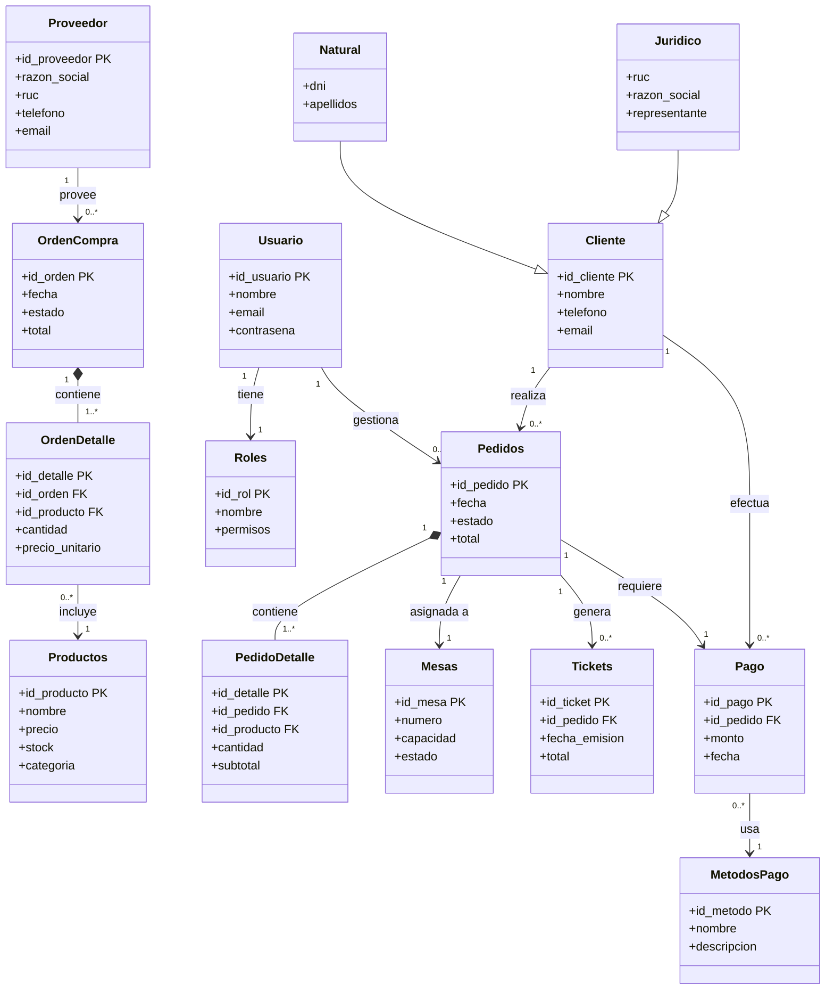

# Diagrama de clases — Sistema de restaurante

## Notas del modelo

- `PK` = llave primaria, `FK` = llave foránea
- `*--` composición (el hijo no existe sin el padre)
- `-->` asociación directa
- `--|>` herencia (Natural y Jurídico extienden Cliente)

## Módulos

| Módulo | Entidades |
|--------|-----------|
| Compras | Proveedor, OrdenCompra, OrdenDetalle, Productos |
| Usuarios | Usuario, Roles |
| Pedidos | Pedidos, PedidoDetalle, Mesas, Tickets |
| Pagos | Pago, MetodosPago |
| Clientes | Cliente, Natural, Juridico |
